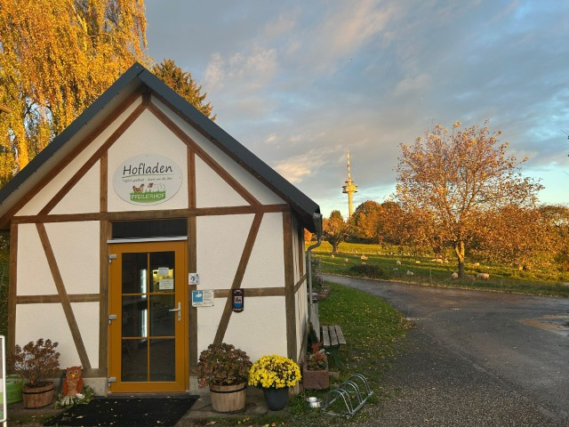
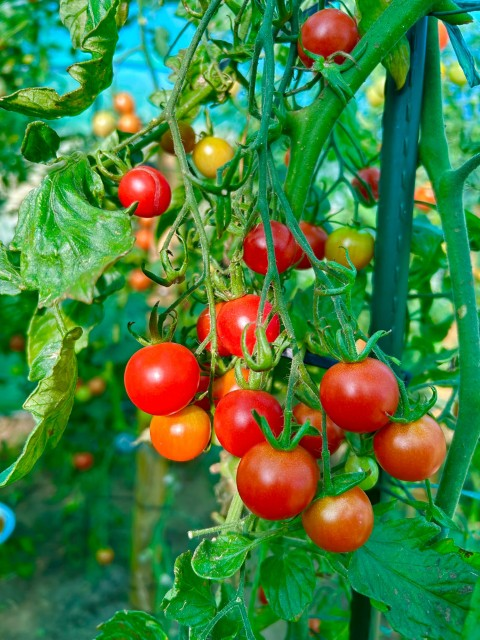

<section markdown="1">

# Der Pfeilerhof

Der Pfeilerhof befindet sich im regionalpark Schwarzwald Mitte - Nord und im Landschaftsschutzgebiet in Grünwettersbach.
Ein typisches Merkmal der Umgebung sind die alten erhaltenswerten Streuobstwiesen mit vielen wildlebenden Tieren und Insekten.
Durch unsere nachhaltige Landbewirtschaftung mit Schafen pflegen wir auf natürliche Weise diese schützenswerte Kulturlandschaft.
Mit Neupflanzungen von Obstbäumen tragen wir zum Erhalt unserer Streuobstwiesen bei.
Der eigene Anbau des Futters für unsere Tiere stellt die Nachhaltigkeit sicher, was die Qualität unserer Produkte gewährleistet.
Tierwohl steht bei uns an erster Stelle. Deshalb halten wir unsere Tiere ganzjährig in Freilandhaltung.
</section>

<section markdown="1">

# Unser Hofladen
## Hauseigene Produkte

- Freilandeier
- Dosenwurst aus Schafsfleisch
- Saisonal Lammfleisch
- Schafsfelle/ Schafswolle
- Suppenhühner (Samstags zwischen 10:00
und 10:30 Uhr)
- Marmeladen und Gelees aus Früchten
- Verschiedener Sirup und Säfte
- Apfelsaft von unseren Streuobstbäumen
- Saisonales Gemüse aus dem Hofgarten
- Suppen aus hofeigenen Produkten im Glas

## Regionale Produkte

- Äpfel vom Obsthof Wenz
- Kartoffeln und Zwiebeln vom Hof Uwe Lengert
- Milchprodukte vom St. Vinzenzhof
- Honig vom ortsnahen Imker
- Mühlenprodukte von den Mühlen Köber und Beck
- Teigwaren von der Nudelmanufaktur Knoll
- Bauernhofeis vom Bauernhof Sorg

und vieles mehr...

Unser Hofladen hat rund um die Uhr geöffnet.
Zahlungsmöglichkeiten: Bargeld oder PayPal
</section>

<section markdown="1">

# Das Team
- Michael Link (Betriebsleiter)
- Jonas Schaufelberger (Betriebsleiter)
- Uwe Freiburger (Mitarbeiter Landwirtschaft)
- Marius Schaufelberger (Mitarbeiter Landwirtschaft)
- Silvia Link (Hofküche)
- Anna Binkele (Hofküche und Hofgarten)
</section>

<section markdown="1">

# Events

Jedes Jahr Veranstalten wir verschiedene Events bei uns am Hof

## Osterfeuer
Das gemütliche Beisammensein am Ostersamstag mit Lagerfeuer, Leckerem vom Grill, kalten und warmen Getränken und Livemusik.

## Kürbisschnitzen für Familien
Gemeinsam könnt Ihr Eure Kürbisgeister gestalten. Alles was ihr hierfür braucht steht bereit. Auf für das leibliche Wohl ist mit Kürbissuppe, Gegrilltem, sowie kalten und warmen Getränken gesorgt.

## Adventsmarkt
Unser kleiner Adventsmarkt am Samstag vor dem zweiten Advent lädt zum Verweilen ein. Regionale Verkaufsstände bieten ihre Waren an, es gibt Aktionen für Kinder, sowie Livemusik. Bei gutem Essen, sowie kalten und warmen Getränken freuen wir uns über geselliges Beisammensein.

## Kuchenverkauf mit Kaffee
Leckere selbstgemachte Backwaren (Kuchen, Schneckennudeln, Hefezöpfe,...). Die Termine werden im Laden und im Internet veröffentlicht.
</section>
